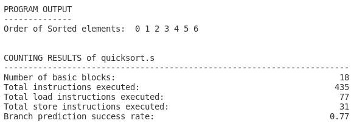

# ASM-Analyser

## Introduction

ASM-Analyser is a tool for dynamic program analysis written in Python 3.9. Currently it is based on ARMv7-A assembly. It can be used to evaluate the number of executed  instructions. In addition, various branch prediction strategies can be simulated.

Currently it is possible to directly provide an ARMv7-A or ARMv7-A compatible assembly file as input or to use a GCC crosscompiler to compile a C program to ARM assembly. The cross-compiler (`arm-linux-gnueabi-gcc`) used in this project can be installed [this](https://www.acmesystems.it/arm9_toolchain) way. The corresponding documentation can be found [here](https://gcc.gnu.org/onlinedocs/gcc/ARM-Options.html).

## Usage

If you want to use an assembly file directly, it should be located in the `test_files/asm` directory. Otherwise, C input programs should be placed in the `test_files/c_in` directory. To execute the script, run the **main.py** the following:

`python main.py -n=PROGRAM_NAME -o=OPTIMIZATION -b=BRANCH_PRED`

The first argument is required and specifies the name of the program you want to run (located in the folder mentioned above). If you pass the filename with the **.s** ending, the assembly file will be used and no C code will be compiled. However, if you use the **.c** ending or no ending, the C code is compiled before the tool is run.

For the compilation process, you can specify the level of optimization GCC should use. This can be either empty or take one of the following values: `-O1`, `-O2`, `-O3`.

The last argument can be used to specify the desired branch prediction strategy. By default, a simple one bit branch prediction is used (one_bit). Currently three different branch prediction methods are implemented: `one_bit`, `two_bit1` and `two_bit2`. The first one uses one single bit to track whether a branch was taken or not during its last execution. The next two methods can be seen as four-state state machines in which the next prediction is based on the current state.

## Example

We can now execute the following command, for example:

`python main.py -n=quicksort -o=-O2 -b=one_bit`

This produces the following output:



We can also see the branch prediction success rate and the number of times each assembly line was executed in the assembly file:
```
1.00 6 	add	r1, r4, #1
1.00 6 	cmp	r1, r6
0.67 6 	blt	.L10
1.00 1 	pop	{r4, r5, r6, r7, r8, r9, r10, pc}
```
For non-branch instructions, the sucess rate is always 1.00.