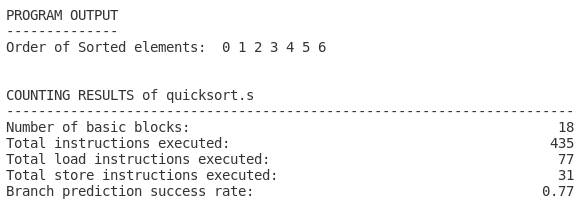

ASM-Analyser
============

Introduction
------------

ASM-Analyser is a tool for dynamic program analysis written in Python 3.9. On older versions than Python 3.6, the tool is not guaranteed to run. Currently it is based on ARMv7-A assembly. The tool can be used to evaluate the number of executed  instructions. In addition, different branch prediction strategies can be simulated.

Currently it is possible to directly provide an ARMv7-A or ARMv7-A compatible assembly file as input or to use a GCC crosscompiler to compile a C program to ARM assembly. The cross-compiler (``arm-linux-gnueabi-gcc``) used in this project can be installed `this <https://www.acmesystems.it/arm9_toolchain>`_ way. The corresponding documentation can be found `here <https://gcc.gnu.org/onlinedocs/gcc/ARM-Options.html>`_.

Usage
-----
To install the package, run ``pip install .`` in the root directory of this project. After installation, the command **asm-analyse** should be available to you. Instead of installing the package and using the command, it is also possible to run the tool by executing the **main.py** file in the **asm_analyser** directory. A few arguments can or need to be passed in order to run the tool:

``asm-analyse -f INPUT_FILE -o OPTIMIZATION -b BRANCH_PRED``

The first argument is required and specifies the path to the input program you want to run. You can either pass an assembly file which then won't be compiled anymore, or a C file.

The next argument can then be used to specify the optimization level with which GCC should compile the C file to assembly. This can be either empty (no optimization) or take one of the following values: ``O1``, ``O2``, ``O3``.

The last argument can be used to specify the desired branch prediction strategy. By default, a simple one bit branch prediction is used (one_bit). Currently three different branch prediction methods are implemented: ``one_bit``, ``two_bit1`` and ``two_bit2``. The first one uses one single bit to track whether a branch was taken or not during its last execution. The next two methods can be seen as four-state state machines in which the next prediction is based on the current state.

Example
------- 

We can now execute the following command, for example:

``asm-analyse -f quicksort.c -o O2 -b one_bit``

This produces the following output:

We can also see the branch prediction success rate and the number of times each assembly line was executed in the assembly file::

    1.00 6 	add	r1, r4, #1
    1.00 6 	cmp	r1, r6
    0.67 6 	blt	.L10
    1.00 1 	pop	{r4, r5, r6, r7, r8, r9, r10, pc}

For non-branch instructions, the sucess rate is always 1.00.

Extensibility
-------------

The developer guide can be found here [TODO]